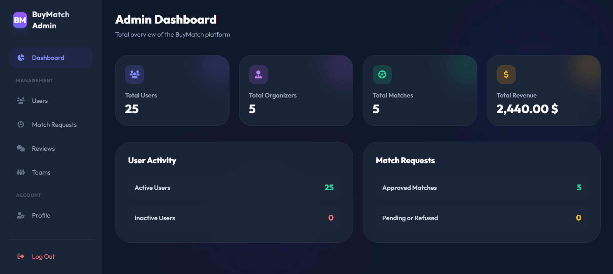
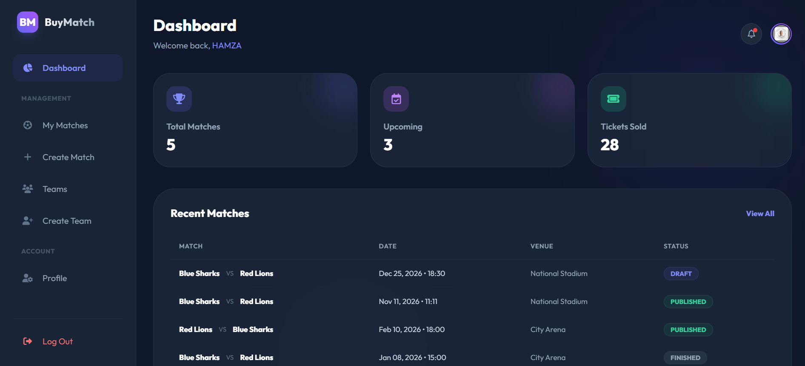
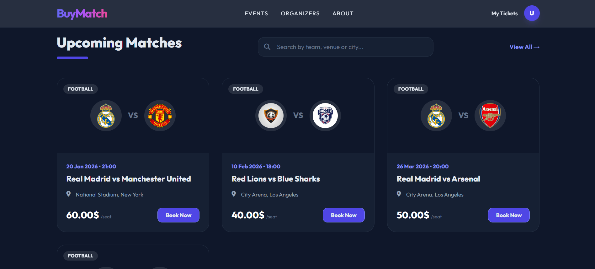

# BuyMatch - Football Match Ticketing System

BuyMatch is a robust, premium football match ticketing platform built with PHP and Tailwind CSS. It provides a seamless experience for fans to buy tickets, organizers to host matches, and administrators to oversee the entire platform.





##  Key Features

###  Buyer (User)

- **Browse Matches**: Discover upcoming matches with detailed information.
- **Ticket Purchase**: Securely buy tickets for specific seat categories.
- **Digital Tickets**: Access purchased tickets with unique QR codes for entry.
- **Match Reviews**: Rate and review matches after attending.
- **Profile Management**: Manage personal information and view ticket history.

###  Organizer

- **Match Management**: Create, edit, and publish football matches.
- **Team & Venue Management**: Maintain a database of teams and venues.
- **Ticket Categories**: Define multiple seat categories with custom pricing.
- **Sales Analytics**: Track ticket sales and revenue through a dedicated dashboard.
- **Automatic Status Updates**: Matches are automatically marked as "FINISHED" after completion.

###  Admin Dashboard

- **Platform Overview**: Global statistics on users, matches, and revenue.
- **User Management**: Toggle user status and approve/reject organizer applications.
- **Match Approval**: Review and approve match requests from organizers.
- **Team Management**: Centralized control over teams and their logos.
- **Review Moderation**: Monitor and delete inappropriate reviews.

##  Tech Stack

- **Backend**: PHP 8.x
- **Frontend**: Tailwind CSS, FontAwesome 6, Google Fonts (Outfit)
- **Database**: MySQL / MariaDB
- **Autoloading**: Custom PHP Autoloader & Composer
- **Icons**: FontAwesome 6.5.1

##  Installation

### Prerequisites

- PHP >= 8.0
- MySQL >= 5.7
- Web Server (Apache/Nginx)
- Composer (Optional, for dependencies)

### Database Setup

1. Create a database named `buyMatch_db`.
2. Import the schema from [docs/db.sql](docs/db.sql).
   ```bash
   mysql -u root -p buyMatch_db < docs/db.sql
   ```

### Application Configuration

1. Open [config/App.php](config/App.php).
2. Update the database credentials:
   ```php
   define('DB_HOST', 'localhost');
   define('DB_USER', 'your_username');
   define('DB_PASS', 'your_password');
   define('DB_NAME', 'buyMatch_db');
   ```
3. Update the `BASE_URL` to match your local setup:
   ```php
   define('BASE_URL', 'http://localhost/buyMatch');
   ```

##  Project Structure

- `/actions`: Backend PHP logic for handling forms and requests.
- `/assets`: Static assets including images, custom JS, and Tailwind configuration.
- `/classes`: Core application logic (Entities, Repositories, DTOs, Helpers).
- `/config`: Database connection and global app configuration.
- `/docs`: Documentation and SQL schema files.
- `/includes`: Reusable UI components and role-based access guards.
- `/pages`: Frontend pages organized by user role.
- `/vendor`: Composer dependencies.

##  Security

- **Role-Based Access Control (RBAC)**: Strict access guards for Admin, Organizer, and Buyer sections.
- **Input Validation**: Sanitized inputs and prepared statements for all database interactions.
- **Session Security**: Secure session management.

##  License

This project is licensed under the MIT License - see the [LICENSE](LICENSE) file for details.
